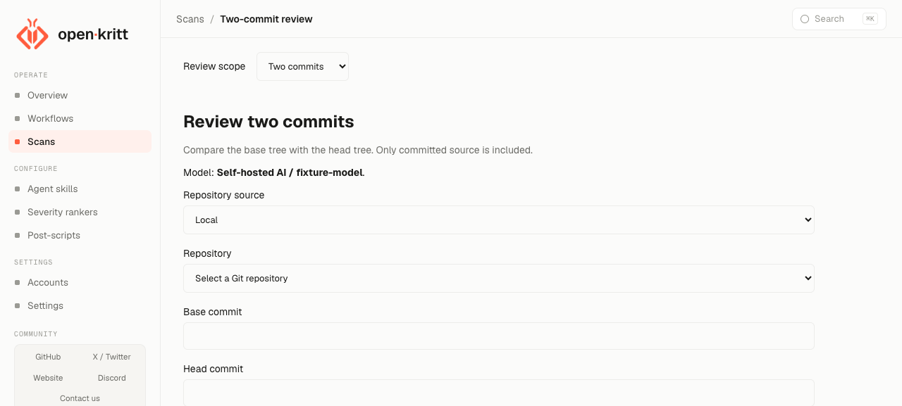

# Local AI and two-commit diff review

Status: implemented on the feature branch. Source baseline: `43e1d19`.

## Outcome

Review source changes between two explicit commits using self-hosted AI by
default. Fit the required controls into the existing Accounts, New Scan, and
results screens. Preserve existing features, layout, provider visibility, and
saved scan settings. This document authorizes no deployment or live model calls.

## Use

In Accounts, save the Self-hosted AI base URL, exact model ID, and API key. Keep
its account active. Test saved connection sends a fixed prompt from the engine
and checks that the model returns the required response format.

New Scan opens in Two commits mode. Select a repository, enter Base commit and
Head commit IDs, then start the review. The engine resolves abbreviated IDs before
calling the model. Results show both full IDs, source findings, and skipped changes.
Export review downloads JSON. Full repository remains available in Review scope.

Local input requires a main Git repository with a `.git` directory. Linked
worktrees are excluded. A comparison accepts up to 1,000 changed files and 8 MiB
of prepared review input. Larger comparisons fail with an error. The engine
splits accepted comparisons into requests of at most 120,000 bytes, preserving
the changed lines and their original base or head locations.
If all changed files are unsupported, results state that no source was reviewed
and no model request was made.

Results show completed and total batches. Each successful batch saves its
findings. Retry resumes from those batches if the revisions, model settings, and
batch inputs still match. Partial results stay labeled incomplete until every
batch finishes. Stop prevents further requests after the current request ends.

Each request allows at most 8,192 generated tokens and 300 seconds. Truncated
responses fail validation. For vLLM endpoints that support a thinking budget,
set `SELF_HOSTED_THINKING_TOKEN_BUDGET` to 1 through 4,096 in the engine environment.
With Compose, set it in `.env` and recreate the engine container. Leave it empty
for other endpoints. This optional limit keeps reasoning enabled
while reserving output tokens for the result. Changing it resets saved progress
on retry. See [vLLM thinking budget control](https://docs.vllm.ai/en/latest/features/reasoning_outputs/#thinking-budget-control).

Text processing has separate limits: 1 MiB per file revision and 8 MiB of source
reads per comparison. The review input limit covers the patch and its metadata.
Large files are checked for binary content using their first 8 KiB.
Files that still exceed the processing limits fail the comparison.

## Scope

- One configurable self-hosted endpoint and one exact model ID.
- Two-commit comparison for existing local Git and GitHub repository inputs.
- Read-only source review with source evidence and remediation guidance.
- No deletion, cleanup, redesign, new navigation, or new framework.
- No branch selector, merge-base comparison, uncommitted changes, PR integration,
  model discovery, automatic cloud fallback, or multiple endpoint profiles.
- No autonomous shell tools, exploit generation, or execution of reviewed code.

## Accounts and defaults

Add a Self-hosted AI card using the existing provider card and credential patterns.
It needs a base URL, model ID, write-only API key input, connection status, and
Test connection action. Reuse the existing active-account behavior.

The deployment values supplied for this installation are:

| Setting | Value |
| --- | --- |
| Base URL | `https://spark-52da.tail9102a4.ts.net/v1` |
| Model | `Qwen3.8-Flash-Next` |
| Existing host key file | `/Users/pushkar/.config/dspark/vllm-api-key` |

These are installation configuration, not hardcoded application defaults. The
key file's contents remain outside source control. Reuse the managed credential
store for a one-time key import through Accounts; do not add arbitrary server
file access to the UI. Never return the saved key or include it in logs, prompts,
scan configuration, or exports.

Select Self-hosted AI by default for new compatible reviews. Existing scans,
duplicates, and explicit provider selections retain their saved choice. If the
local provider is missing, inactive, or unavailable, show a setup or retry error.
Never silently select a cloud provider. Existing providers remain selectable for
their supported flows.

Use a direct Chat Completions adapter for bounded source review. Reuse installed
dependencies or Python's standard library. Do not route this through a CLI that
requires an unverified API or tool capability. Unsupported workflow steps must
fail validation before launch rather than being skipped or changing behavior.

Test connection uses a small fixed prompt with no repository content and checks
the exact model and structured response needed by the review adapter. Run it from
the engine's inference environment. Validate TLS, restrict calls to the configured
endpoint, and do not forward credentials through redirects. Bound request time,
input size, and response size. Report connection, authentication, model, and
invalid-output errors separately. Do not expose unsupported reasoning controls.

## Two-commit input and meaning

Add a Full repository / Two commits scope choice within New Scan. Keep the full
repository flow intact. Two commits requires Base commit and Head commit fields
alongside the existing repository input. Use Head commit instead of displaying a
second, redundant target commit field.

Accept commit object IDs, including unambiguous abbreviated IDs. Resolve both to
full commit IDs in the selected repository before starting model work. Reject
missing, ambiguous, non-commit, or unavailable objects with a field-level error.
Do not accept branch names, tags, or implicit HEAD in this mode.

Compare the base tree directly with the head tree. Ancestry is not required, and
there is no merge-base substitution. Reversing the inputs reverses the comparison.
Identical trees produce an explicit no-changes result without an inference call.

For local repositories, read committed objects before the existing snapshot path
discards `.git`. Build an isolated review input from those objects, not from the
working tree. Leave the user's files, index, branch, and Git configuration intact.
For GitHub repositories, use existing repository access and credential handling
to obtain both objects. Do not execute repository hooks or external diff helpers.

Include text additions, modifications, deletions, and renames. Preserve base-side
locations for deleted code and head-side locations for new code. Record binary,
submodule, or other unsupported changes as unreviewed. Renames without text
changes and file-mode changes have no source lines to review and are listed as
unreviewed. If context exceeds the adapter's configured bound, report that limit
rather than silently truncating or claiming complete coverage. Treat repository
content as untrusted data.

## Review and results

Supply the patch and bounded surrounding source from the pinned revisions.
Findings must explain how the change introduces or exposes the issue, cite the
relevant revision, path, and lines, and suggest a correction. Separate uncertainty
from confirmed source evidence. Do not include unrelated pre-existing findings.

Reuse existing result cards and the Markdown renderer. Show both full commit IDs
and any unreviewed changes in scan details. Preserve the existing result contract
where compatible; do not fabricate exploit examples or execution evidence to
satisfy legacy required fields. Any necessary source-review result adaptation
must preserve existing scans and exports.

## Smallest implementation boundary

Reuse provider configuration, active-account checks, scan lifecycle, and result
presentation. Add only the provider adapter and comparison inputs they lack.

Persist an explicit comparison mode and resolved base commit. Reuse the existing
target commit field for the resolved head where compatible. Keep old records in
full-repository mode. Preserve the comparison on duplication and retries, and
show the revision pair before launching a duplicate. Schema changes must use an
additive, idempotent migration with matching Prisma changes.

Relevant existing code:

- [Accounts UI](../frontend/src/pages/Accounts.jsx) and
  [credential storage](../backend/src/lib/providerCredentials.js).
- [Model selection](../frontend/src/lib/modelProviders.js) and
  [backend provider validation](../backend/src/lib/constants.js).
- [New Scan](../frontend/src/pages/CreateScan.jsx),
  [scan validation](../backend/src/lib/validation.js), and
  [scan routes](../backend/src/routes/scans.js).
- [Repository preparation](../engine/open_kritt_engine/repository.py),
  [model execution](../engine/open_kritt_engine/harnesses.py), and
  [database schema](../backend/prisma/schema.prisma).

## Acceptance checks

1. A new compatible review selects the configured local model. Existing saved
   selections remain intact. Local failure never invokes another provider.
2. A mock endpoint verifies request shape, bounded failures, structured-output
   validation, credential redaction, and active-account enforcement.
3. A disposable Git fixture covers edits, deletion, rename, identical trees,
   reversed inputs, unrelated commits, invalid IDs, and unsupported file types.
   Uncommitted edits never enter the review, and the source checkout is unchanged.
4. A review records the exact revision pair and renders findings on the correct
   side. Skipped content and input limits remain visible. Duplication preserves
   comparison settings. Existing full-repository behavior still passes its tests.
5. Run the required frontend, backend, engine, and documentation gates for touched
   areas from AGENTS.md. Run any migration twice. Verify the Docker flow with a
   mock model, then separately validate the configured live endpoint when approved.

Verification uses disposable Git fixtures, a mock model, and an isolated
database. The supplied Qwen endpoint passed a connection and response-format
check from the isolated engine. Multi-batch tests cover complete changed-line
coverage, saved progress, retries, cancellation, and failures.
